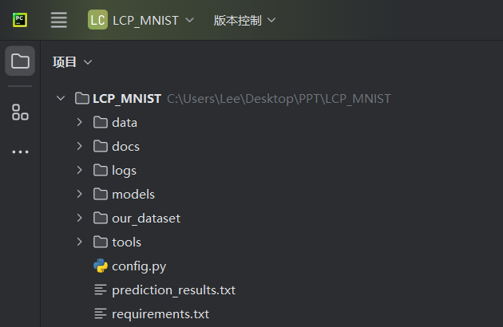
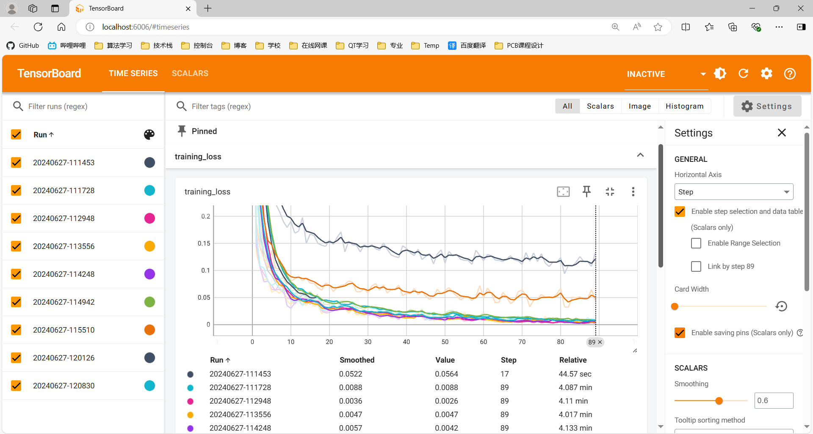
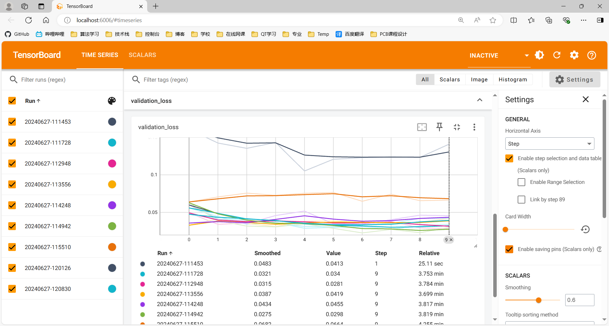
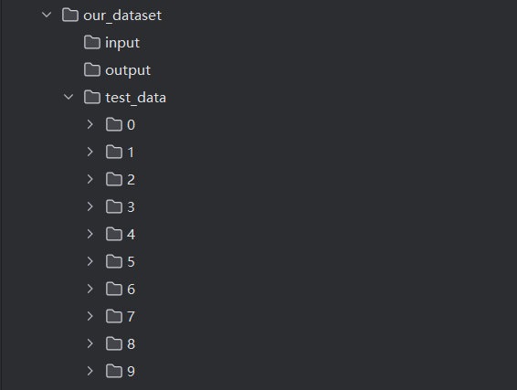

# 一、使用教程



<center>项目结构图</center>

#### **项目目录说明**

- data文件夹是保存MNIST官方数据集的文件夹，无需改动

- docs文件夹是保存我们的项目说明文档和相关图片，无需改动

- logs文件夹是保存我们已经训练过的不同模型的训练损失和验证损失可视化结果（基于Tensorboard），不需改动

- models文件夹是用来保存卷积神经网络模型代码，其中**LeNet.py，ney.py，vgg16.py**是老师提供的初始模型，其中vgg16.py中的**vgg模型**和LeNet.py中的**Module模型**已被我们调试好，可以运行；

- our_dataset文件夹是用来保存我们自己制作的数据集，包含自己手写数字图片，与标签文件等


- tools文件夹存放有用于图片处理的process.py，训练train.py，以及用于评估的evaluate.py程序等


#### **环境配置**

本项目所使用的有关软件和外部依赖库版本为：

PyCharm Community Edition 2024.1.3          Python 3.11.7                    **torchvision**

**tensorboard**                    **opencv-python**         matplotlib~=3.8.0            pillow~=10.2.0

1. 在启动虚拟环境下使用pip命令安装opencv­—python：

```shell
pip install opencv-python -i <https://pypi.tuna.tsinghua.edu.cn/simple> 
```

2. 安装pytorch:

```shell
pip install torch torchvision torchaudio -i https://pypi.tuna.tsinghua.edu.cn/simple
```

3. 安装**Tensorboard**:

   在本次项目中我们使用tensordboard工具对训练过程中的训练损失和验证损失进行记录并以曲线的形式呈现。

```shell
pip install tensorboard
```


# 二、模型建立与优化

关于MNIST的基础卷积神经网络是这样设计的，

1. 第一层是一个卷积层，输入通道是1，输出通道是32，卷积核大小是3×3。输入维度是1×28×28，输出维度是32×28×28。

2. 第二层是一个下采样层，采样核大小是2×2，输入维度是32×28×28，输出维度是32×14×14。

3. 第三层是一个卷积层，输入通道是32，输出通道是64，卷积核大小是3×3。输入维度是32×14×14，输出维度是64×14×14。

4. 第四层是一个下采样层，采样核大小是2×2，输入维度是64×14×14，输出维度是64×7×7。

5. 第五层是展平层，张量维度为64×7×7。

6. 第六层是一个全连接层，输出神经元个数为128个。

7. 第七层是一个全连接层，输出神经元个数为10个。

   代码如下：

```python
import torch.nn as nn
import torch.nn.functional as F

class CNN(nn.Module):
    def __init__(self):
        super(CNN, self).__init__()
        self.conv1 = nn.Conv2d(1, 32, kernel_size=3, padding=1)
        self.conv2 = nn.Conv2d(32, 64, kernel_size=3, padding=1)
        self.pool = nn.MaxPool2d(kernel_size=2, stride=2, padding=0)
        self.fc1 = nn.Linear(128 * 7 * 7, 128)
        self.fc2 = nn.Linear(128, 10)

    def forward(self, x):
        x = self.pool(F.relu(self.conv1(x)))
        x = self.pool(F.relu(self.conv2(x)))
        x = x.view(-1, 128 * 7 * 7)
        x = F.relu(self.fc1(x))
        x = self.fc2(x)
```

在基础的卷积神经网络CNN下我们进行了修改，给出了一个目前调试得最好的CNN模型，其设计如下：

1. 第一层是一个卷积层，输入通道是1，输出通道是32，卷积核大小是3×3。输入维度是1×28×28，输出维度是32×28×28。

2. 第二层是一个下采样层，采样核大小是2×2，输入维度是32×28×28，输出维度是32×14×14。

3. 第三层是一个卷积层，输入通道是32，输出通道是64，卷积核大小是3×3。输入维度是32×14×14，输出维度是64×14×14。

4. 第四层是一个下采样层，采样核大小是2×2，输入维度是64×14×14，输出维度是64×7×7。

5. 第五层是一个卷积层，输入通道是64，输出通道是128，卷积核大小是3×3。输入维度是64×7×7，输出维度是128×7×7。

6. 第六层是展平层，张量维度为128×7×7。

7. 第七层是一个全连接层，输出神经元个数为128个。

8. 第八层是一个全连接层，输出神经元个数为256个。

9. 第九层是一个全连接层，输出神经元个数为10个。

   代码如下：

```python
import torch.nn as nn
import torch.nn.functional as F

class CNN(nn.Module):
    def __init__(self):
        super(CNN, self).__init__()
        self.conv1 = nn.Conv2d(1, 32, kernel_size=3, padding=1)
        self.conv2 = nn.Conv2d(32, 64, kernel_size=3, padding=1)
        self.conv3 = nn.Conv2d(64, 128, kernel_size=3, padding=1)
        self.pool = nn.MaxPool2d(kernel_size=2, stride=2, padding=0)
        self.fc1 = nn.Linear(128 * 7 * 7, 128)
        self.fc2 = nn.Linear(128, 256)
        self.fc3 = nn.Linear(256, 10)

    def forward(self, x):
        x = self.pool(F.relu(self.conv1(x)))
        x = self.pool(F.relu(self.conv2(x)))
        x = (F.relu(self.conv3(x)))
        x = x.view(-1, 128 * 7 * 7)
        x = F.relu(self.fc1(x))
        x = F.relu(self.fc2(x))
        x = self.fc3(x)
```

此外我们还基于CNN调试了其他三个模型，但效果不如上文调试出的最好模型，下面做出简要介绍:

- 第一个：在基础模型上往欠拟合方向进行改动：在第一个全连接层后加入dropout层进行正则化

- 第二个：在最佳模型上往欠拟合方向进行改动：删除第三个卷积层

- 第三个：在最佳模型上往过拟合方向进行改动：将卷积核大小改为5 * 5

# 三、模型训练

​		运行tools文件夹下的**train.py**文件，会分别选择对应的神经网络进行训练。训练后生成**.pth**保存训练好的模型权重，以及在**logs**文件夹的**fit**下面生成一个保存训练过程中损失数据的文件。

#### **训练结果可视化**

​	利用tensorboard，使用时可在pycharm的终端下使用命令：

```shell
tensorboard--logdir="(路径替换为自己的路径)"
```

​	这会生成一个端口，进入端口即可查看记录数据

#### **模型测试**

1. 在our_dataset/test_data文件夹下的10个文件夹下放入对应的手写数字图片，图片长和宽随意，注意图片要是黑底白字的。

2. 如果要测试训练好的CNN模型，请运行tools文件夹下的**trained.py**

3. 然后会在modules文件下生成一个**mnist_cnn.pth**，这样就保存好了训练好的模型。

   

**准确率参考：**

<center>表1 不同模型在验证集上的最终准确率</center>

|    model     | Accuracy | epoch |
| :----------: | :------: | :---: |
|  CNN(初始)   |  98.56%  |   2   |
| VGG16(初始)  |  10.39%  |   2   |
| Module(初始) |  10.10%  |   2   |


<center>表2 CNN模型在不同优化器测试后的最终准确率</center>

| trained-model | 优化器 |      | epoch |
| :-----------: | :----: | :--: | :---: |
|      CNN      |  SGD   | 93%  |  10   |
|      CNN      |  Adam  | 97%  |  10   |
|   CNN(best)   |  Adam  | 99%  |  10   |


# **四、训练结果可视化**

​		运行tensorboard命令即可在浏览器中查看训练结果：



<center>CNN+Adam的训练损失曲线</center>



<center>CNN+Adam的验证损失曲线</center>

# 五、制作自己的数据集

our_dataset文件夹下有三个文件夹，input、output、test_data。

- **input**文件夹下，保存未处理的手写图片，比如保存数字1的手写图片，依次类推。
- **output**文件夹下，保存从input文件夹中读取的所有图片，并经过了相关的处理。
- **test_data**文件夹下，保存有我们处理好并经过标签分类好的测试图片。

整个目录树如图所示：



## 手写图片制作

​		打开windows画板，或者使用平板，写一些数字，然后用图片编辑软件裁剪图片，使得数字大概在裁剪图片的中心，然后在our_dataset/input文件夹下的10个文件夹下放入对应的手写数字图片。

​		我使用平板写的10个数字如下：


## 图片批处理与标签生成

运行**process.py**，这样就会把input文件下的图片转换为黑底白字


# 六、最终测试效果

​	运行tools下的evaluate.py，话不多说，直接放图（自设置CNN+Adam）：

